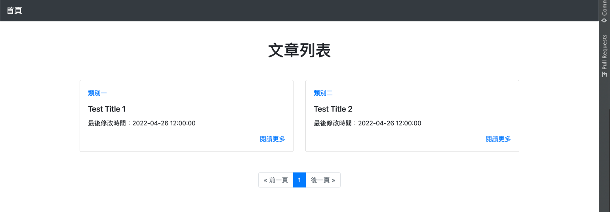
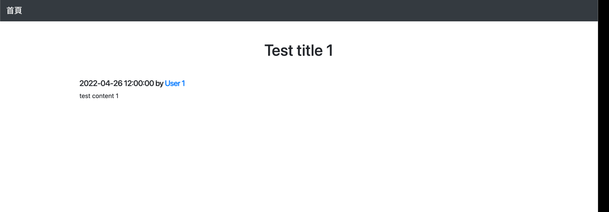

# 1-qute

## 前言
經過前章節 0-init ，相信對於 Quarkus 有初步的了解。  
回到我們一開始的專案規劃，我們來完成讓非用戶觀看所有已發布文章的功能。  
針對這個功能我們規劃為以下兩頁

1. 瀏覽發布的文章  
* url path: /
* 可以查看所有發布的文章
* 能夠過關鍵字篩選文章 ex. 作者、分類
* 需要有分頁
* 只顯示必要資訊 ex. 分類、標題、作者、最後更新時間

2. 查看發布文章的詳細內容
* url path: /posts/{postId}
* 顯示完整資訊

為了 SEO 需要加入 meta tag

## First Page
* 在開始寫前我們先調整一下專案結構，將 root package 調整為 net.aotter.quarkus.tutorial 底下新增 resource package 擺放關於 JAX-RS 的 resource
* 前一章節的範例 GreetingResource 還有 test 因為用不到所以可以直接刪除
* 預設的 index.html 也不用了直接刪除即可

新增 PostResource.kt 在 net.aotter.quarkus.tutorial.resource 底下，此時專案結構會長的如下

```
├── src
│  ├── main
│  │  ├── docker
│  │  │   ├── Dockerfile.jvm
│  │  │   ├── Dockerfile.legacy-jar
│  │  │   ├── Dockerfile.native
│  │  │   └── Dockerfile.native-micro
│  │  ├── kotlin
│  │  │   └── net
│  │  │      └── aotter
│  │  │          └── quarkus
│  │  │              └── tutorial
│  │  │                  └── resource
│  │  │                      └── PostResource.kt
│  │  └── resources
│  │      ├── META-INF
│  │      │  └── resources
│  │      └── application.properties
│  └── test
│      └── kotlin
│          └── net
│              └── aotter
```

****

* 我們在 PostResource.kt 新增 listPosts method 回傳 html 格式的文字
* @Path("/") 指定 resource mapping path
* 規劃 PostResource 負責回傳 html 頁面，直接在 class 上標注 @Produces(MediaType.TEXT_HTML) 指定資源可以生成及回應客戶端的 MIME media types 為 text/html
* @GET 指定 HTTP method 為 GET ，瀏覽器在向 server 請求 html 頁面是發送 GET 請求
```kotlin
package net.aotter.quarkus.tutorial.resource

import javax.ws.rs.GET
import javax.ws.rs.Path
import javax.ws.rs.Produces
import javax.ws.rs.core.MediaType

@Path("/")
@Produces(MediaType.TEXT_HTML)
class PostResource {
    
    @GET
    fun listPosts(): String =
        """
            <!DOCTYPE html>
            <html lang="en">
            <head>
                <meta charset="UTF-8">
                <meta http-equiv="X-UA-Compatible" content="IE=edge">
                <meta name="viewport" content="width=device-width, initial-scale=1.0">
                <title>BLOG</title>
            </head>
            <body>
                <h1>First Page</h1>
            </body>
            </html>
        """.trimIndent()
}
```
****

由於開發模式熱重載，直接打開瀏覽器訪問 http://localhost:8080 ，就可以看到畫面顯示 First Page。  
雖然達成目的，但直接將 html 寫死在程式碼，可讀性非常差也不好維護，上面範例只是靜態的 html ，若是還要動態結合資料會更加複雜。  
要怎麼解決這個問題呢？就要介紹到這章節的重點 Qute


## Qute 介紹

Qute 是專為 Quarkus 設計的 Templating Engine (模板引擎)。  
模板引擎可以動態渲染出 Html ,也會提供變數、條件、迴圈功能來撰寫更簡潔的程式碼，能夠更加輕鬆維護程式碼。

#### 首先我們要加入 quarkus-resteasy-reactive-qute extension
可以透過以下兩種方法加入
1. Maven plugin
```shell
./mvnw quarkus:add-extension -Dextensions="io.quarkus:quarkus-resteasy-reactive-qute"
```
2. 修改 pom.xml 加上 dependency ,由於 quarkus-bom 已經幫我們管理 quarkus extension 的版本所以這邊不需要指定 version
```xml
<dependency>
    <groupId>io.quarkus</groupId>
    <artifactId>quarkus-resteasy-reactive-qute</artifactId>
</dependency>
```

默認情況下，在 src/main/resources/templates 底下的文件會被註冊為模板。  
我們新增 templates 資料夾，並在其底下新增 posts.html，將原本寫死在 PostResource.kt 的字串移到 posts.html。  
將 h1 tag 的內容改成 {title} ，這是一個表達式會在模板渲染時計算。

src/main/resources/templates/posts.html
```html
<!DOCTYPE html>
<html lang="en">
<head>
    <meta charset="UTF-8">
    <meta http-equiv="X-UA-Compatible" content="IE=edge">
    <meta name="viewport" content="width=device-width, initial-scale=1.0">
    <title>BLOG</title>
</head>
<body>
    <h1>{title}</h1>
</body>
</html>
```
* 透過 @Inject 注入模板，這邊是透過 quarkus-arc 提供的 Dependency Injection (倚賴注入) 達成，我們下面解釋
* 如果沒有使用 @Location 指定位置就會使用變數名去定位，這個例子我們會注入這個路徑的模板 templates/posts.html
* 我們將原本 listPosts method 回傳值改為 TemplateInstance
* Template.data() 會回傳 template instance, 我們可以在它渲染前做些操作設定，例如我們將設定一組 key map,設定的資料可以在渲染時被模板取用
* 我們不需要手動觸發渲染，他會自動在 ContainerResponseFilter 中完成

src/main/kotlin/net/aotter/quarkus/tutorial/resource/PostResource
```kotlin
package net.aotter.quarkus.tutorial.resource

import io.quarkus.qute.Template
import io.quarkus.qute.TemplateInstance
import javax.inject.Inject
import javax.ws.rs.GET
import javax.ws.rs.Path
import javax.ws.rs.Produces
import javax.ws.rs.core.MediaType

@Path("/")
@Produces(MediaType.TEXT_HTML)
class PostResource {

    @Inject
    lateinit var posts: Template

    @GET
    fun listPosts(): TemplateInstance = posts.data("title", "First Qute")
}
```

我們再次透過瀏覽器訪問 http://localhost:8080  
會發現標題已經改為我們設定的 First Qute 了

## Type-safe templates
除了上面提到的方式，還有另外一種方式來使用模板，它依賴於以下約定

* 對於 resource 所參考的模板放置的位置為 src/main/resources/templates/{resourceName}/{templateName}。
以我們的例子來說， PostResource.kt 中使用的 posts.html 應該為 /src/main/resources/templates/PostResource/posts.html
* 每個 resource 需要宣告 static class Templates {} 加上 @CheckedTemplate (在 kotlin 使用 object 達到 static class)
* 對每個 template file 宣告 public static native TemplateInstance method() (在 kotlin 使用 @JvmStatic external fun method(): TemplateInstance )
* 使用宣告的 static method 來建構 template instance

我們使用 Type-safe templates 方式來改寫上面的例子  
將 posts.html 移到 src/main/resources/templates/PostResource/posts.html  
按照上面約定改寫 PostResource

src/main/kotlin/net/aotter/quarkus/tutorial/resource/PostResource
```kotlin
package net.aotter.quarkus.tutorial.resource

import io.quarkus.qute.CheckedTemplate
import io.quarkus.qute.TemplateInstance
import javax.ws.rs.GET
import javax.ws.rs.Path
import javax.ws.rs.Produces
import javax.ws.rs.core.MediaType

@Path("/")
@Produces(MediaType.TEXT_HTML)
class PostResource {

    @CheckedTemplate
    object Templates{
        @JvmStatic
        external fun posts(): TemplateInstance
    }

    @GET
    fun listPosts(): TemplateInstance = Templates.posts().data("title", "First Qute")
}
```
我們重新整理瀏覽器就會發現出了問題，他告訴我們使用 type-safe template 時，我們在 posts.html 中使用的表達式 {title}  需要宣告為 external fun posts(): TemplateInstance 的參數。 
* 你可以通過 @CheckedTemplate(requireTypeSafeExpressions = false) 告訴它不要檢查  
* type-safe template 好處是經由他的檢查就不會出現忘記設定模板需要的資料的情況，所以這邊我們修改 posts() 將 title 做為參數，順便把 title 改成這頁的標題

```kotlin
@CheckedTemplate
object Templates{
    @JvmStatic
    external fun posts(title: String): TemplateInstance
}

@GET
fun listPosts(): TemplateInstance = Templates.posts("BLOG")
```
再次整理瀏覽器就會發現又正常了

## 容器與倚賴注入

#### 什麼是 Bean
bean 是一種 container-managed (受容器管理) 的物件，它提供了基本的功能像是 injection of dependencies (倚賴注入), lifecycle callbacks (生命週期的回調) and interceptors (攔截器)

#### 什麼是 Container 
* container 是應用程式執行的環境，他負責管理 bean 實例的創建與銷毀，並將 bean 指定的上下文關聯注入到其他 bean。
* 使用者不直接控制實例的生命週期，透過 annotation 或設定去影響他
* 帶來的好處是開發人員無需關注 bean 在哪裡創建要如何取得，可以專注在業務邏輯上

#### 如何使用 Bean 與注入 Bean
* 有不同種類的 bean 可以透過 scope annotation 標註告訴 container 這個 bean 的實例與哪個上下文關聯
* 透過 @Inject 指定注入點，告訴容器這個 bean 倚賴哪些其他 bean
* 除了 field 還可以使用建構子注入(常規的 CDI 實作不支持，Quarkus 動了點手腳)、
[initializer methods](https://jakarta.ee/specifications/cdi/2.0/cdi-spec-2.0.html#initializer_methods)
(取代 setter inject)
* 注入是通過 bean type ，如果有相同的 bean type 存在可以透過內建的 Qualifier annotations @Named 指定注入 bean 的名稱
* 也可以透過 @Default 設定預設注入的 bean
* 建議默認使用 @ApplicationScoped，除非有充分的理由使用 @Singleton

更詳細的介紹可以參考官方指引 [INTRODUCTION TO CONTEXTS AND DEPENDENCY INJECTION](https://quarkus.io/guides/cdi)

## Include Section
#### Static Resource
我們先為網站加入 favicon ，瀏覽器預設會去抓 /favicon.ico 路徑底下的圖示，  
上一章節有提到 quarkus 會映射 src/main/resources/META-INF.resources 底下的檔案
所以你可以直接將 favicon.ico 檔案放到 src/main/resources/META-INF.resources 即可。  
但這邊我們使用另一種方式，在 src/main/resources/META-INF.resources 底下新增 assets 資料夾管理靜態檔案 ex 圖片、js、css  
我們借用一下電獺官網的 [icon](https://aotter.net/assets/images/favicon.png) (請注意智慧財產權！！！)，  
下載在 asset 底下新增 images 資料夾專門擺放網站用到的圖片，將 icon 下載後放到資料夾中，路徑長這樣 src/main/resource/META-INF.resource/assets/images/favicon.png  
瀏覽器打開 http://localhost:8080/assets/images/favicon.png ，就會看到我們剛剛放進去的 icon
再來只要透過 <link rel="icon" href="/assets/images/favicon.png"> 指定我們 icon 路徑就好了

#### 我們使用 bootstrap 來刻畫面

posts.html
```html
<!doctype html>
<html lang="en">
<head>
  <!-- Required meta tags -->
  <meta charset="utf-8">
  <meta name="viewport" content="width=device-width, initial-scale=1, shrink-to-fit=no">
  <!-- Bootstrap CSS -->
  <link rel="stylesheet" href="https://cdn.jsdelivr.net/npm/bootstrap@4.6.1/dist/css/bootstrap.min.css"
        integrity="sha384-zCbKRCUGaJDkqS1kPbPd7TveP5iyJE0EjAuZQTgFLD2ylzuqKfdKlfG/eSrtxUkn" crossorigin="anonymous">
  <title>{title}</title>
  <meta name="title" content="{title}">
  <meta name="description" content="BLOG 有很多精彩的文章">
  <!-- Open Graph / Facebook -->
  <meta property="og:type" content="website">
  <meta property="og:url" content="#">
  <meta property="og:title" content="{title}">
  <meta property="og:description" content="BLOG 有很多精彩文章">
  <meta property="og:image" content="#">
  
  <link rel="icon" href="/assets/images/favicon.png">  
</head>
<body>
<header>
  <!-- Fixed navbar -->
  <nav class="navbar navbar-expand-md navbar-dark bg-dark">
    <a class="navbar-brand" href="/">首頁</a>
    <button class="navbar-toggler" type="button" data-toggle="collapse" data-target="#navbarCollapse">
      <span class="navbar-toggler-icon"></span>
    </button>
    <div class="collapse navbar-collapse" id="navbarCollapse">
      <ul class="navbar-nav mr-auto">
        <li class="nav-item">
        </li>
      </ul>
    </div>
  </nav>
</header>

<main role="main" class="container">
  <h1 class="my-5 text-center">文章列表</h1>
  <div class="row">
    <div class="col-sm-12 col-lg-6 my-1">
      <div class="card">
        <div class="card-body">
          <p>
            <a class="my-5" href="#">類別一</a>
          </p>
          <h5 class="card-title">Test Title 1</h5>
          <p class="card-text">最後修改時間：2022-04-26 12:00:00</p>
          <p class="text-right mb-0">
            <a href="#" >閱讀更多</a>
          </p>
        </div>
      </div>
    </div>
    <div class="col-sm-12 col-lg-6 my-1">
      <div class="card">
        <div class="card-body">
          <p>
            <a class="my-5" href="#">類別二</a>
          </p>
          <h5 class="card-title">Test Title 2</h5>
          <p class="card-text">最後修改時間：2022-04-26 12:00:00</p>
          <p class="text-right mb-0">
            <a href="#" >閱讀更多</a>
          </p>
        </div>
      </div>
    </div>
  </div>
  <nav class="my-5">
    <ul class="pagination justify-content-center">
      <li class="page-item disabled"><a class="page-link" href="#">&laquo; 前一頁</a></li>
      <li class="page-item active"><a class="page-link" href="#">1</a></li>
      <li class="page-item disabled"><a class="page-link" href="#">後一頁 &raquo;</a></li>
    </ul>
  </nav>
</main>

<!-- jQuery and Bootstrap Bundle (includes Popper) -->
<script src="https://cdn.jsdelivr.net/npm/jquery@3.5.1/dist/jquery.slim.min.js" integrity="sha384-DfXdz2htPH0lsSSs5nCTpuj/zy4C+OGpamoFVy38MVBnE+IbbVYUew+OrCXaRkfj" crossorigin="anonymous"></script>
<script src="https://cdn.jsdelivr.net/npm/bootstrap@4.6.1/dist/js/bootstrap.bundle.min.js" integrity="sha384-fQybjgWLrvvRgtW6bFlB7jaZrFsaBXjsOMm/tB9LTS58ONXgqbR9W8oWht/amnpF" crossorigin="anonymous"></script>

</body>
</html>
```

畫面結果



通常網頁的外框都是相同的，不同的只有內容。  
每次都複製貼上不僅麻煩，當你要改動其中一個部分時，所有檔案都要修改，容易發生忘記改的情況。
可以透過 qute 提供的 {#include} {#insert} 去模組化你的 template。
* 將 posts.html 中共用的部分提到新的檔案 src/main/resources/templates/layout.html 中
* 在 layout.html 將每頁不同的部分用 #{insert} 宣告 ex. main tag
* 在 posts.html include layout ，在指定覆蓋的區塊
* meta tag 的部分，雖然每個網頁都有所以放在 layout ，但每次需要設定不同的值。
* 創建 src/main/kotlin/net/aotter/quarkus/tutorial/model/vo/HTMLMetaData 用來紀錄 meta tag 的值
* 修改 PostResource method 將 HTMLMetaData 傳入模板，在 layout 使用

layout.html
```html
<!doctype html>
<html lang="en">
<head>
    <!-- Required meta tags -->
    <meta charset="utf-8">
    <meta name="viewport" content="width=device-width, initial-scale=1, shrink-to-fit=no">
    <!-- Bootstrap CSS -->
    <link rel="stylesheet" href="https://cdn.jsdelivr.net/npm/bootstrap@4.6.1/dist/css/bootstrap.min.css"
          integrity="sha384-zCbKRCUGaJDkqS1kPbPd7TveP5iyJE0EjAuZQTgFLD2ylzuqKfdKlfG/eSrtxUkn" crossorigin="anonymous">

    <title>{metaData.title}</title>
    <meta name="title" content="{metaData.title}">
    <meta name="description" content="{metaData.description}">
    <!-- Open Graph / Facebook -->
    <meta property="og:type" content="{metaData.type}">
    <meta property="og:url" content="{metaData.url}">
    <meta property="og:title" content="{metaData.title}}">
    <meta property="og:description" content="{metaData.description}">
    <meta property="og:image" content="{metaData.image}">

    <link rel="icon" href="/assets/images/favicon.png">
</head>
<body>
<header>
    <!-- Fixed navbar -->
    <nav class="navbar navbar-expand-md navbar-dark bg-dark">
        <a class="navbar-brand" href="/">首頁</a>
        <button class="navbar-toggler" type="button" data-toggle="collapse" data-target="#navbarCollapse">
            <span class="navbar-toggler-icon"></span>
        </button>
        <div class="collapse navbar-collapse" id="navbarCollapse">
            <ul class="navbar-nav mr-auto">
                <li class="nav-item">
                </li>
            </ul>
        </div>
    </nav>
</header>

{#insert main}{/}

<!-- jQuery and Bootstrap Bundle (includes Popper) -->
<script src="https://cdn.jsdelivr.net/npm/jquery@3.5.1/dist/jquery.slim.min.js" integrity="sha384-DfXdz2htPH0lsSSs5nCTpuj/zy4C+OGpamoFVy38MVBnE+IbbVYUew+OrCXaRkfj" crossorigin="anonymous"></script>
<script src="https://cdn.jsdelivr.net/npm/bootstrap@4.6.1/dist/js/bootstrap.bundle.min.js" integrity="sha384-fQybjgWLrvvRgtW6bFlB7jaZrFsaBXjsOMm/tB9LTS58ONXgqbR9W8oWht/amnpF" crossorigin="anonymous"></script>

</body>
</html>
```
posts.html

```html
{#include layout}
{#main}
<main role="main" class="container">
  <h1 class="my-5 text-center">文章列表</h1>
  <div class="row">
    <div class="col-sm-12 col-lg-6 my-1">
      <div class="card">
        <div class="card-body">
          <p>
            <a class="my-5" href="#">類別一</a>
          </p>
          <h5 class="card-title">Test Title 1</h5>
          <p class="card-text">最後修改時間：2022-04-26 12:00:00</p>
          <p class="text-right mb-0">
            <a href="#" >閱讀更多</a>
          </p>
        </div>
      </div>
    </div>
    <div class="col-sm-12 col-lg-6 my-1">
      <div class="card">
        <div class="card-body">
          <p>
            <a class="my-5" href="#">類別二</a>
          </p>
          <h5 class="card-title">Test Title 2</h5>
          <p class="card-text">最後修改時間：2022-04-26 12:00:00</p>
          <p class="text-right mb-0">
            <a href="#" >閱讀更多</a>
          </p>
        </div>
      </div>
    </div>
  </div>
  <nav class="my-5">
    <ul class="pagination justify-content-center">
      <li class="page-item disabled"><a class="page-link" href="#">&laquo; 前一頁</a></li>
      <li class="page-item active"><a class="page-link" href="#">1</a></li>
      <li class="page-item disabled"><a class="page-link" href="#">後一頁 &raquo;</a></li>
    </ul>
  </nav>
</main>
{/main}
{/include}
```
HTMLMetaData.kt

```kotlin
package net.aotter.quarkus.tutorial.model.vo

data class HTMLMetaData(
    var title: String,
    var type: String,
    var description: String,
    var url: String,
    var image: String
)
```
PostResource.kt

```kotlin
package net.aotter.quarkus.tutorial.resource

import io.quarkus.qute.CheckedTemplate
import io.quarkus.qute.TemplateInstance
import net.aotter.quarkus.tutorial.model.vo.HTMLMetaData
import javax.ws.rs.GET
import javax.ws.rs.Path
import javax.ws.rs.Produces
import javax.ws.rs.core.Context
import javax.ws.rs.core.MediaType
import javax.ws.rs.core.UriInfo

@Path("/")
@Produces(MediaType.TEXT_HTML)
class PostResource {
    @Context
    lateinit var uriInfo: UriInfo

    @CheckedTemplate
    object Templates{
        @JvmStatic
        external fun posts(metaData: HTMLMetaData): TemplateInstance
    }

    @GET
    fun listPosts(): TemplateInstance {
        val metaData = buildHTMLMetaData(
            title = "BLOG",
            type = "website",
            description = "BLOG 有許多好文章"
        )
        return Templates.posts(metaData)
    }
    
    private fun buildHTMLMetaData(title: String, type: String, description: String, image: String = ""): HTMLMetaData{
        val url = uriInfo.baseUriBuilder
            .path(uriInfo.requestUri.path.toString())
            .build().toString()

        val descriptionSummary =
            if (description.length <= 20) description
            else description.substring(0, 20) + "..."

        return HTMLMetaData(title, type, descriptionSummary, url, image)
    }
}
```
* og:url 要求沒有參數的網址，所以手動去除參數
* 考量到 description 可能太長，手動取前 20 個字
* buildHTMLMetaData 方法與注入 UriInfo 可以考慮提到 abstract class 讓所有需要的 resource 繼承，因為這個範例只有一個 resource 使用到就不做了

完成了瀏覽發布文章的頁面，接下來我們來完成發布文章詳細內容的頁面
* 新增 src/main/resource/templates/PostResource/postDetail.html
* 一樣 include layout ，簡單拉一下畫面
* 在 PostResource 的 Templates 新增 postDetail 方法
* 在 PostResource 新增方法 showPostDetail ，標註 @Path("{/id}") @GET

postDetail.html
```html
{#include layout}
{#main}
<main role="main" class="container">
    <h1 class="my-5 text-center">Test title 1</h1>
    <h5>2022-04-26 12:00:00 by <a href="#">User 1</a></h5>
    <p>test content 1</p>
</main>
{/}
{/}
```

PostResource.kt
```kotlin
package net.aotter.quarkus.tutorial.resource

import io.quarkus.qute.CheckedTemplate
import io.quarkus.qute.TemplateInstance
import net.aotter.quarkus.tutorial.model.vo.HTMLMetaData
import javax.ws.rs.GET
import javax.ws.rs.Path
import javax.ws.rs.Produces
import javax.ws.rs.core.Context
import javax.ws.rs.core.MediaType
import javax.ws.rs.core.UriInfo

@Path("/")
@Produces(MediaType.TEXT_HTML)
class PostResource {
    @Context
    lateinit var uriInfo: UriInfo

    @CheckedTemplate
    object Templates{
        @JvmStatic
        external fun posts(metaData: HTMLMetaData): TemplateInstance
        @JvmStatic
        external fun postDetail(metaData: HTMLMetaData): TemplateInstance
    }

    @GET
    fun listPosts(): TemplateInstance {
        val metaData = buildHTMLMetaData(
            title = "BLOG",
            type = "website",
            description = "BLOG 有許多好文章"
        )
        return Templates.posts(metaData)
    }

    @Path("/posts/{postId}")
    @GET
    fun showPostDetail(): TemplateInstance {
        val metaData = buildHTMLMetaData(
            title = "BLOG-Test title 1",
            type = "article",
            description = "Test content 1"
        )
        return Templates.postDetail(metaData)
    }

    private fun buildHTMLMetaData(title: String, type: String, description: String, image: String = ""): HTMLMetaData{
        val url = uriInfo.baseUriBuilder
            .path(uriInfo.requestUri.path.toString())
            .build().toString()

        val descriptionSummary =
            if (description.length <= 20) description
            else description.substring(0, 20) + "..."

        return HTMLMetaData(title, type, descriptionSummary, url, image)
    }
}
```
完成後使用瀏覽器訪問 http://localhost:8080/posts/123 ，postId先隨便打只是要看畫面



qute 還有許多語法像是 if 、 for 之類的這裡就先不介紹，之後有用到會再稍微描述。
更詳細的介紹可以參考官方指引 [QUTE REFERENCE GUIDE](https://quarkus.io/guides/qute-reference)
