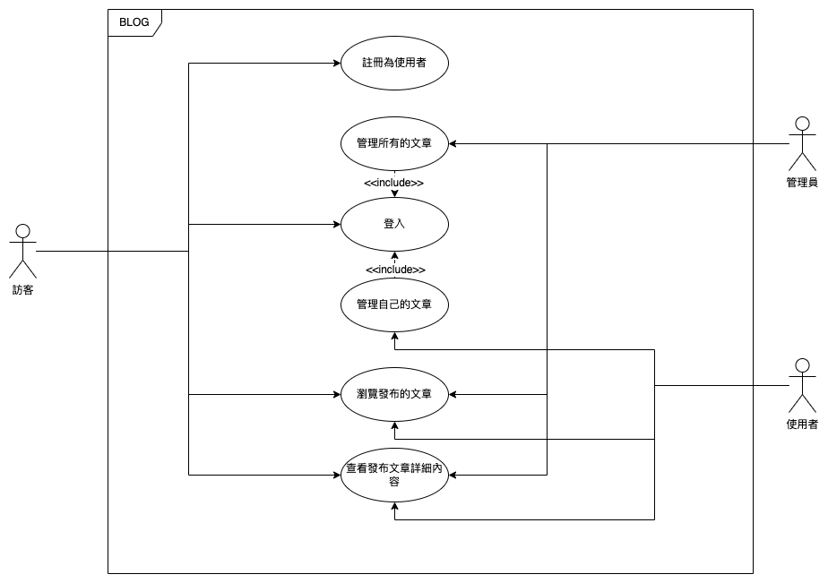

# aotter-quarkus-tutorial

## 專案目的：


1. 協助未使用過 quarkus 的人快速上手該框架
2. 協助新人了解電獺的 coding convention，tech stack， 以及要符合的 best practice 有哪些
    1. tech stack: kotlin-coroutine-mongodb
    2. resource/serivice/repository 分層
    3. fontend
        1. qute：public pages
        2. vue-cli：admin console, SPA

## 專案功能：

從零開始建立 quarkus 專案，目標是完成一個可以讓用戶註冊登入後，透過後台發布文章，非用戶可在前台觀看所有已發布文章。管理者則可以在後台系統管理所有文章。

## 使用案例：




## 語言與框架：

Kotlin + Quarkus

## 開發模式：

```shell script
./mwnw compile quarkus:dev
```
